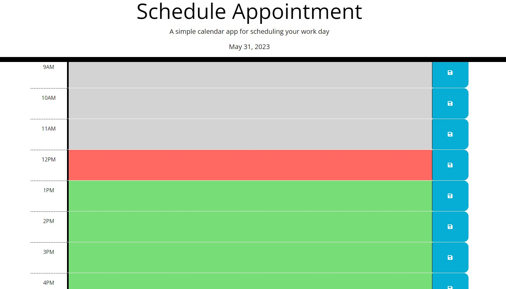
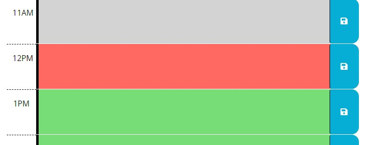
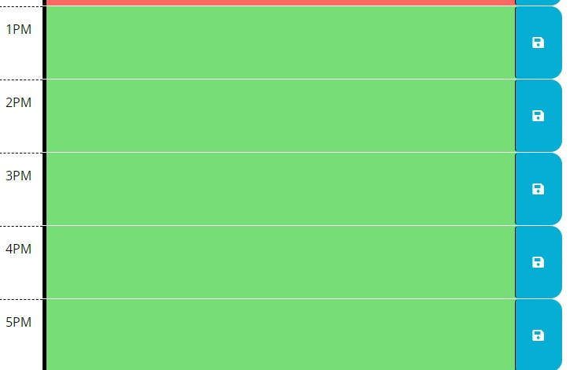
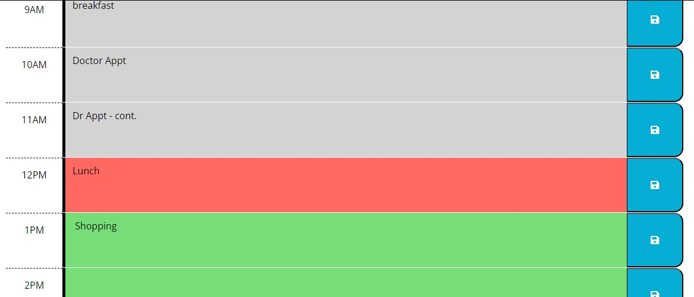

# schedule-appointment
challenge 5-create booking appointment

* ACCEPTANCE CRITERIA 

- THEN I am presented with timeblocks for standard business hours
- THEN each timeblock is color coded to indicate 
- THEN I can enter an event
- THEN the text for that event is saved in local storage
- THEN the saved events persist

* This live appointment scheduler. The current Day and Date are display on the top and you are allowed to go back to previous,present, future dates to add any information as needed. And you will be able to save the dates on any desire hours.

* Once you pick the desire hour, enter the comments,notes or appointment information
* You can click on the save button
* Access the local storage and see the information was saved
* Can also see the console tab and see any notes that save.

* The gray represent the past live hours

* The red represent the current live hours

* The green represent the future live hours

* Once add the text,comments and or notes, you can save

